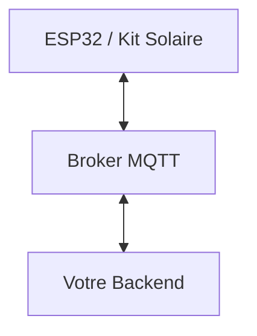

# Guide de Récupération des Données IoT (ESP32) pour le Développeur Backend

Ce guide est destiné au développeur en charge du backend principal de **Djua Energy**. Il explique comment s'interfacer avec les passerelles IoT (ESP32) pour recevoir la télémétrie, capturer les alertes de fraude en temps réel et envoyer des commandes aux kits solaires.

---

## 1. Protocoles et Flux de Communication

La passerelle ESP32 communique via le protocole **MQTT** (léger, bidirectionnel et adapté aux connexions mobiles instables). 



### Paramètres de connexion de l'ESP32 :
*   **Broker (Host) :** `mqtt.djuaenergy.orange.cd` (ou l'IP locale configurée en laboratoire, ex: `10.20.20.184`)
*   **Port :** `1883` (par défaut) ou `5500` (selon la configuration réseau locale)
*   **Authentification par défaut (Labo) :**
    *   *Username :* `djua_device`
    *   *Password :* `djua_pass_2026`

---

## 2. Structure des Topics et Payloads JSON

L'ESP32 communique via 4 topics principaux basés sur son identifiant unique (`deviceId`, ex: `DJUA-KIN-000001`).

### A. Télémétrie Périodique (Écoute / Subscribe)
L'ESP32 publie ses constantes de consommation toutes les **60 secondes** (en production) ou toutes les **4 secondes** (en simulation).

*   **Topic :** `djua/{deviceId}/telemetry`
*   **Payload JSON type :**
```json
{
  "deviceId": "DJUA-KIN-000001",
  "timestamp": "2026-08-01T15:02:44Z",     // Date au format ISO 8601 UTC
  "batteryVoltage": 11.64,                  // Tension de la batterie (V)
  "batteryCurrent": 0.148,                  // Courant de la batterie (A)
  "batterySOC": 82,                         // État de charge (%)
  "panelVoltage": 13.12,                    // Tension du panneau (V)
  "panelCurrent": 0.235,                    // Courant du panneau (A)
  "panelPower": 3.08,                       // Puissance générée (W)
  "latitude": -4.32761,                     // Données GPS
  "longitude": 15.31352,
  "speed": 0.0,                             // Vitesse de déplacement du kit (km/h)
  "firmwareVersion": "1.0.0-SIM"
}
```

### B. Alertes Immédiates (Écoute / Subscribe)
Envoyé instantanément par l'ESP32 en cas de détection d'anomalie critique (secousse ou ouverture du boîtier).

*   **Topic :** `djua/{deviceId}/alerts`
*   **Payload JSON type :**
```json
{
  "deviceId": "DJUA-KIN-000001",
  "timestamp": "2026-08-01T15:00:00Z",
  "alertType": "enclosureOpened",           // Type d'alerte : "enclosureOpened" ou "vibration"
  "details": "Boîtier ouvert détecté.",
  "latitude": -4.32761,
  "longitude": 15.31352
}
```

### C. Statut de Connexion (Écoute / Subscribe)
Géré via le mécanisme *Last Will and Testament* (LWT) du protocole MQTT pour détecter les pannes de réseau instantanément.
*   **Topic :** `djua/{deviceId}/status`
*   **Payload (Texte brut) :** `"online"` ou `"offline"`

---

## 3. Comment récupérer ces données dans votre Backend ?

Votre backend doit se connecter au broker MQTT d'Orange et s'abonner au topic wildcard **`djua/+/+`** pour capturer tous les messages de tous les kits solaires.

Voici des exemples d'intégration pour différentes technologies de backend :

### Option A : Si votre backend est en Node.js (Express/NestJS)
Installez la bibliothèque standard `mqtt` (`npm install mqtt`).

```javascript
const mqtt = require('mqtt');

// Connexion au broker MQTT
const client = mqtt.connect('mqtt://10.20.20.184:1883', {
  username: 'djua_device',
  password: 'djua_pass_2026',
  clientId: 'DjuaMainBackend'
});

client.on('connect', () => {
  console.log('Connecté au broker MQTT Djua.');
  // S'abonner aux télémétries, alertes et statuts de tous les kits
  client.subscribe('djua/+/+');
});

client.on('message', (topic, message) => {
  const parts = topic.split('/');
  const deviceId = parts[1];
  const dataType = parts[2]; // 'telemetry', 'alerts', ou 'status'
  const rawPayload = message.toString();

  try {
    const payload = JSON.parse(rawPayload);
    
    if (dataType === 'telemetry') {
      // Stocker en base de données (ex: InfluxDB, PostgreSQL, MongoDB)
      saveTelemetry(deviceId, payload);
    } else if (dataType === 'alerts') {
      // Déclencher une notification push, e-mail ou SMS d'alerte
      triggerSecurityAlert(deviceId, payload);
    }
  } catch (e) {
    // Si le statut est en texte brut (ex: "online" / "offline")
    if (dataType === 'status') {
      updateDeviceStatus(deviceId, rawPayload);
    }
  }
});
```

### Option B : Si votre backend est en Python (Django/FastAPI)
Installez le package `paho-mqtt` (`pip install paho-mqtt`).

```python
import paho.mqtt.client as mqtt
import json

def on_connect(client, userdata, flags, rc):
    print("Connecté au broker MQTT")
    client.subscribe("djua/+/+")

def on_message(client, userdata, msg):
    topic_parts = msg.topic.split('/')
    device_id = topic_parts[1]
    data_type = topic_parts[2]
    payload_str = msg.payload.decode()

    try:
        data = json.loads(payload_str)
        if data_type == "telemetry":
            print(f"Télémétrie de {device_id} reçue : Batterie {data['batteryVoltage']}V")
            # Votre logique de sauvegarde en BDD...
        elif data_type == "alerts":
            print(f"⚠️ ALERTE sur {device_id} : {data['details']}")
    except ValueError:
        if data_type == "status":
            print(f"Statut de {device_id} : {payload_str}")

client = mqtt.Client(client_id="DjuaPythonBackend")
client.username_pw_set("djua_device", "djua_pass_2026")
client.on_connect = on_connect
client.on_message = on_message

client.connect("10.20.20.184", 1883, 60)
client.loop_forever()
```

---

## 4. Envoyer des commandes à l'ESP32 (Actionneur / Publish)

Pour envoyer une action à un kit solaire spécifique, votre backend doit **publier** un message JSON sur le topic de commande de l'appareil.

*   **Topic de commande :** `djua/{deviceId}/commands`
*   **Format JSON requis :**
```json
{
  "command": "NOM_DE_LA_COMMANDE",
  "timestamp": "2026-07-31T15:00:00Z"
}
```

### Liste des commandes prises en charge par l'ESP32 :
1.  **`lockDevice`** : Verrouille immédiatement le kit (coupe la sortie, active la led rouge/le buzzer d'alerte, affiche "SYSTEM VERROUILLE" sur le LCD).
2.  **`unlockDevice`** : Déverrouille et rétablit le fonctionnement normal.
3.  **`reboot`** : Force l'ESP32 à redémarrer matériellement.
4.  **`requestTelemetry`** : Demande à l'ESP32 d'envoyer sa télémétrie immédiatement.

#### Exemple d'envoi de commande (Node.js) :
```javascript
function sendCommand(deviceId, commandName) {
  const topic = `djua/${deviceId}/commands`;
  const payload = JSON.stringify({
    command: commandName,
    timestamp: new Date().toISOString()
  });

  client.publish(topic, payload, { qos: 1 }, (err) => {
    if (!err) {
      console.log(`Commande ${commandName} envoyée avec succès à ${deviceId}`);
    }
  });
}

// Utilisation :
sendCommand('DJUA-KIN-000001', 'lockDevice');
```

## 5. Alternative HTTP/HTTPS pour un déploiement serverless

Un backend déployé sur Vercel ne peut pas héberger un broker MQTT TCP permanent.
Le backend2 expose donc une passerelle HTTP pour les ESP32 :

```text
POST https://<domaine-vercel>/api/iot/{deviceId}/telemetry
POST https://<domaine-vercel>/api/iot/{deviceId}/alerts
POST https://<domaine-vercel>/api/iot/{deviceId}/status
GET  https://<domaine-vercel>/api/iot/{deviceId}/commands
```

Chaque requête doit contenir `Content-Type: application/json` et
`x-device-token: <valeur de IOT_API_KEY>`.

Les commandes sont récupérées par polling HTTP. Le serveur les met en file lorsque
MQTT est indisponible. Il faut définir `IOT_API_KEY` dans les variables
d'environnement Vercel ; cette valeur ne doit pas être codée dans le dépôt.
