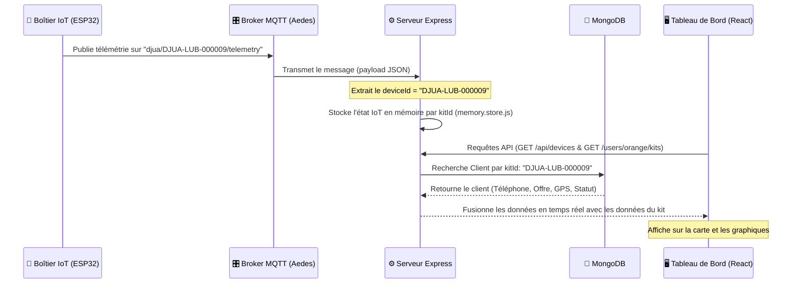

# Architecture & Flux de Données IoT Télémétrie

Ce document détaille le fonctionnement en temps réel et la liaison entre les boîtiers IoT (ESP32), le protocole MQTT, la base de données MongoDB (cache local) et l'interface utilisateur (React).

---

## 💡 Explication Simple (Pour les Non-Développeurs)

Pour comprendre comment les données du boîtier physique sur le terrain arrivent sur l'écran du gestionnaire, voici l'explication étape par étape sans termes complexes :

1. **Le Boîtier physique (sur le terrain) :** Chaque kit solaire est équipé d'un petit boîtier intelligent (IoT). Ce boîtier mesure en permanence la santé du kit (tension de la batterie, énergie produite par le panneau solaire, s'il a été déplacé ou ouvert illégalement, et sa position GPS).
2. **Le Voyage des données :** Toutes les 10 secondes, le boîtier envoie ces mesures par internet sous forme de colis numérique sécurisé. Ce message contient uniquement un identifiant unique (le numéro du kit, ex: `DJUA-LUB-000009`) et les mesures.
3. **Le Serveur (le tri postal) :** Notre serveur reçoit ce colis. Pour savoir à qui il appartient, il regarde dans ses classeurs (la base de données). Il cherche le kit `DJUA-LUB-000009` et découvre quel est l'abonnement et le numéro de téléphone liés. 
4. **Confidentialité & Sécurité :** Pour respecter la vie privée des clients, le serveur sépare les informations. Il n'enregistre **jamais** de données personnelles sensibles (comme l'identité civile ou les revenus des clients) dans la base publique de télémétrie.
5. **La Page Web (l'écran final) :** L'interface utilisateur sur l'ordinateur se met à jour automatiquement en lisant le serveur. Elle affiche le kit sur la carte géographique et dessine les courbes de consommation d'énergie pour aider l'équipe opérationnelle à surveiller la flotte en direct.

---

## 🗺️ Schéma du Flux Global

Le flux de télémétrie s'articule autour d'une clé d'identification unique : le **`kitId`** (nommé `deviceId` côté MQTT).



---

## 📡 1. Couche Connectivité & IoT (MQTT)

Les boîtiers ESP32 sur le terrain publient des payloads au format JSON toutes les 10 secondes.

### Format des Topics MQTT
*   **Télémétrie :** `djua/<kitId>/telemetry`
*   **Statut / Présence :** `djua/<kitId>/status`
*   **Alertes (ex: ouverture boîtier) :** `djua/<kitId>/alerts`
*   **Commandes (descendantes) :** `djua/device/<kitId>/commands`

### Exemple de payload de télémétrie envoyé par l'ESP32
```json
{
  "timestamp": "2026-08-11T07:15:30Z",
  "batteryVoltage": 12.8,
  "batteryCurrent": 1.2,
  "batterySOC": 92,
  "panelVoltage": 18.2,
  "panelCurrent": 2.5,
  "panelPower": 45.5,
  "latitude": -11.6701,
  "longitude": 27.4795,
  "speed": 0.0,
  "firmwareVersion": "1.0.4"
}
```

---

## ⚙️ 2. Couche Serveur & Broker embarqué (Backend)

Le backend héberge à la fois le broker MQTT interne et le client d'écoute :

1.  **Broker Aedes (`src/broker/mqtt.broker.js`) :** Gère le serveur de sockets MQTT sur le port `1883`.
2.  **Service d'Écoute (`src/services/mqtt.service.js`) :** Se connecte au broker, s'abonne à `djua/#` et distribue les données reçues.
3.  **Store Mémoire (`src/store/memory.store.js`) :** La télémétrie en temps réel étant très volatile, elle est stockée en mémoire vive (RAM) sous forme de dictionnaire clé-valeur indexé par le `kitId` pour des performances maximales.

---

## 💾 3. Modèle de Données & Confidentialité (MongoDB)

Pour lier les signaux physiques (IoT) avec les abonnements clients sans stocker de données d'identité civile sensibles dans la couche télémétrie :

Le modèle **`Client`** ([client.model.js](file:///d:/Chris_djua/backend2/src/models/client.model.js)) a été restreint pour des raisons de conformité et de sécurité. Il agit comme le pivot de liaison :

```javascript
const ClientSchema = new mongoose.Schema({
  kitId: {
    type: String,      // Clé pivot (ex: "DJUA-LUB-000009")
    required: true,
    unique: true,
    index: true,
  },
  clientPhone: {
    type: String,      // Téléphone de l'abonné
    required: true,
    index: true,
  },
  offerName: String,   // Offre liée
  installationDate: Date,
  subscriptionFeePaid: Boolean,
  status: String,      // Statut commercial
  gpsCoordinates: {
    latitude: Number,
    longitude: Number
  }
});
```

---

## 🖥️ 4. Consommation & Affichage (Frontend)

L'interface React consolide et affiche ces flux :

1.  **Récupération (TanStack Query) :** Le hook [useTelemetryStream.js](file:///d:/Chris_djua/frontend/src/hooks/tanstack/useTelemetryStream.js) réinterroge l'API du backend toutes les **10 secondes** (`refetchInterval: 10000`).
2.  **Agrégation :** Les kits synchronisés et l'état en direct des boîtiers IoT sont fusionnés par `kitId` pour dresser la liste des équipements en ligne, calculer la charge moyenne des batteries, afficher la puissance générée par les panneaux, et positionner avec précision chaque kit sur la carte géographique **Leaflet**.
